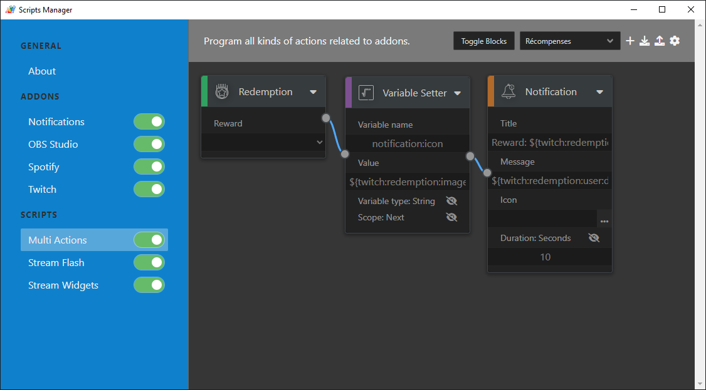

# Scripts Manager

Program grouping together a multitude of scripts to avoid redeveloping everything each time.
<br />To know everything about how this software works, documentation is available in the `Wiki` tab at the top of the page.



### For Developers

Before using the commands that follow, you must install the dependencies with the following command _(you must be in the project folder)_:
```
npm install
```

To launch the project from source _(note: add your twitch app's client_id in `addons/twitch/auth.json`, and same in spotify)_:
```
npm start
```

To compile the project and make it an executable:
```
npm run build
```

### Notes

If you are developing __addons__ or __scripts__ for this tool, you can directly tell me about it on Discord __Arubinu#9947__ _(I may suggest a repository to group them together)_.

In any case, thank you for using this tool, which is close to my heart 🙂
